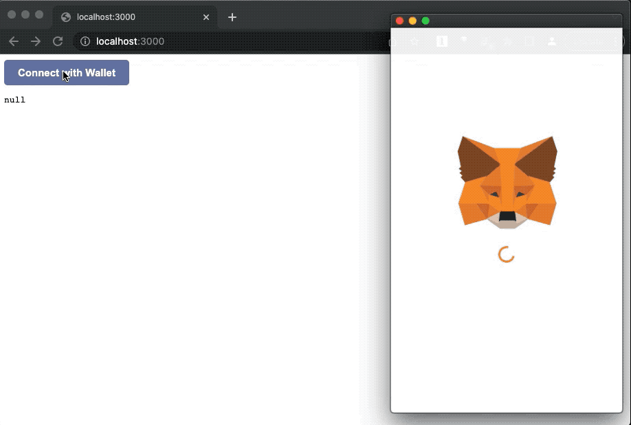

# reactparty

Partybutton demo for a simple react app

> Looking for a next.js demo? See https://github.com/privatepart/nextparty

# Setup

First clone this repository and install dependencies

```
git clone https://github.com/privatepart/reactparty.git
cd reactparty
npm install
```

# Usage

Styled button



Run:

```
npm start
```

This will launch both the privateparty server (an express app at port 4200) and a react dev server (at port 3000)

1. Client code: [client](client)
2. Server code: [server](server)

> **NOTE**
>
> Since the privateparty server and the next.js dev server are running on different ports during development and will cause CORS issues, we utilize the [proxy feature](https://create-react-app.dev/docs/proxying-api-requests-in-development/) to proxy th    e 4 private party endpoints (see [package.json](package.json)). This issue only exists during dev environment because you're running a dev server. In production, frontend code and the backend will be hosted on the same domain so no cors issues.
